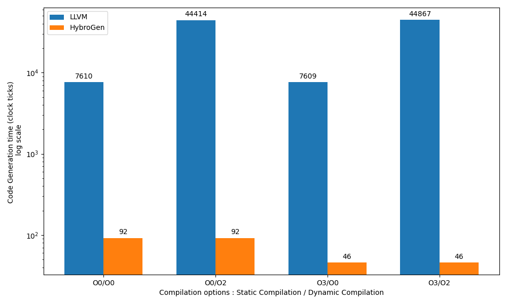

# Vector Matrix demonstration

This directory contains a Vector Matrix demonstration

## Code speed execution

[TBD]

## Code speed generation 
* HybroLang version [VectorMatrix.hl](VectorMatrix.hl)
* LLVM JITed version [LLVM-22-VxM-4x4-chatgpt.c](LLVM-22-VxM-4x4-chatgpt.c)
* Code generation speed values : [LLVM-Code-Gen-Speed-Experiment.ods](LLVM-Code-Gen-Speed-Experiment.ods)
* The figure shows "Code generation speed : comparison between LLVM-22 ORC with
    HybroGen for a 4x4 vector matrix code. Clock ticks, log scale, the
    lower, the better. O0-O3 are compilation option for the static
    compiler, O0-O2 are compilation option for the LLVM JIT

